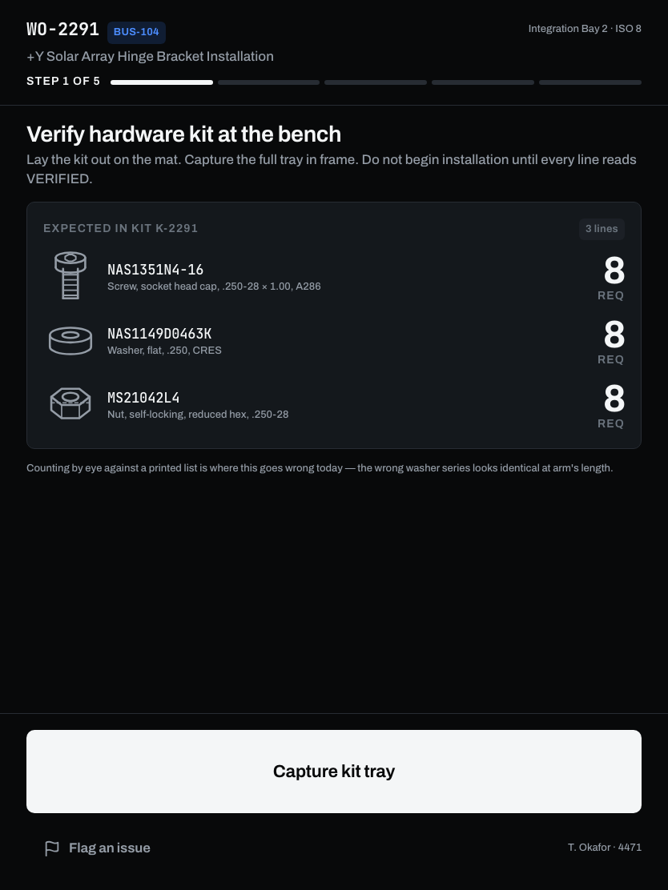
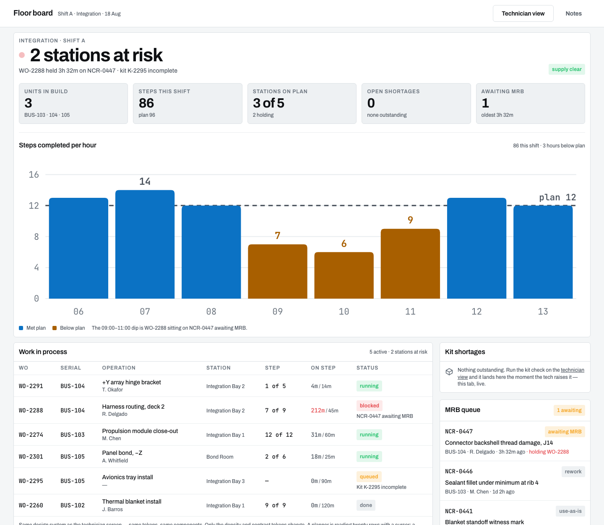

# Bench

Build-execution software for a spacecraft factory floor, built as a concept study. One work order, two screens: the technician's tablet on the floor and the planner's board at the desk. They share one design system and one state, so a problem raised at the bench shows up on the planner's board the moment it happens.

**Live:** [bench-seven.vercel.app](https://bench-seven.vercel.app) · [`/floor`](https://bench-seven.vercel.app/floor) (technician, open at tablet width) · [`/plan`](https://bench-seven.vercel.app/plan) (planner, desktop) · [`/`](https://bench-seven.vercel.app) (the six design decisions and why)

Open `/floor` and `/plan` side by side, run the kit check on the floor, and watch the shortage land on the planner board.

<p>
  
  &nbsp;&nbsp;
  
</p>

## What it does

**Technician (`/floor`).** One step per screen. The kit is verified before installation starts: lay the parts on the mat, capture the tray, and every line has to read VERIFIED before the step can advance. Torque sequence and fastener stack-up are enforced in order. Raising an issue is one tap. Signing off a step takes a hold, because that is the action you cannot undo. Built for a gloved hand in a noisy room: large targets, high contrast, identifiers in mono so they can be read aloud.

**Planner (`/plan`).** Stations at risk, steps completed per hour against plan, work in process, kit shortages, and the MRB queue on one screen. Dense on purpose. A planner is reading twenty rows with a cursor.

**Shared state.** Floor and desk talk through `localStorage` and `BroadcastChannel` (`lib/store.ts`), so there is no server and the two tabs stay in sync on one machine.

## Where it came from

Bench started as a product I designed for a pitch at SpaceX: an iPad tool for technicians on the vehicle that photographs the fixture, confirms the right fasteners are actually in hand, and alerts supply when they are not. This is that idea built out, with the planner's side added.

## Design system

One token source in `app/globals.css`. The floor and desk surfaces define the same semantic variables at different densities and contrasts, and components never branch on surface. Named type scale only, one button system, and status colors (`go`, `hold`, `stop`) that nothing decorative may borrow.

The rules are enforced at precommit by `scripts/guard.mjs`. It checks only the lines added in the staged diff, so existing debt never blocks a commit and new debt cannot get in. `npm run guard:audit` reports the whole repo. See `CLAUDE.md` for the full contract.

## Run it locally

```bash
npm install
npm run dev      # http://localhost:3000
npm run guard    # design-system precommit check
```

Next.js 16 (App Router) · React 19 · Tailwind v4 · TypeScript · no component library. Hardware is drawn as SVG line art (`components/art/Parts.tsx`) because a sectioned profile shows thickness, and thickness is the difference between two washers with near-identical part numbers.

## Not affiliated

Not affiliated with any company. Every part number, torque value, work order, and serial in it is invented.

---

Designed and built by [Bryan S. Holland](https://automaticdelight.com) · [portfolio](https://portfolio.automaticdelight.com) · [resume](https://automaticdelight.com/resume) · bryan@automaticdelight.com
